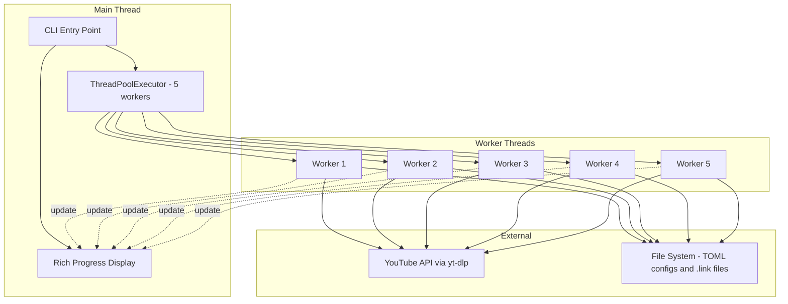

# Multithreaded fetch_links Implementation Plan

## Overview

This document outlines the plan to parallelize the `fetch_links` command using a pool of 5 worker threads while providing meaningful CLI progress feedback similar to Rust's cargo or Julia's package manager.

## Feasibility Assessment

### ✅ FEASIBLE

The parallelization is feasible based on the following analysis:

### Current Implementation

The current [`make_links()`](../videos/functions.py:63) function:
1. Iterates sequentially over channel configurations (TOML files)
2. For each channel, calls `yt-dlp` to fetch playlist metadata
3. Writes `.link` files for new videos
4. Updates the channel's TOML config with progress markers

### Why Parallelization Works

1. **Independent Channels**: Each channel configuration is independent - different TOML files, different yt-dlp calls
2. **I/O-Bound Operations**: Network requests to YouTube/other platforms are I/O-bound, making threading ideal
3. **Existing Pattern**: The project already uses `ThreadPoolExecutor` in [`threads.py`](../videos/threads.py:1) for downloads
4. **Rich Library Support**: Rich's Progress class is designed for multi-threaded progress visualization

### Challenges and Mitigations

| Challenge | Mitigation |
|-----------|------------|
| Thread-safe config updates | Each channel has its own TOML file - no shared state |
| yt-dlp thread safety | Each worker creates its own `YoutubeDL` instance |
| Progress display coordination | Rich's Progress class handles this natively |
| Error handling per channel | Catch exceptions per-channel, log errors, continue with others |

## Architecture

### Component Diagram



### Progress Display Design - Cargo Style

The progress display will show:
1. **Overall progress bar**: Channels processed / total channels
2. **Per-worker status lines**: What each worker is currently doing
3. **Completion messages**: Logged above the progress display

Example output:
```
Fetching video links from 12 channels...
━━━━━━━━━━━━━━━━━━━━━━━━━━━━━━━━━━━━━━━━ 100% 0:00:00
[Worker 1] ✓ TechChannel - 3 new videos
[Worker 2] ✓ ScienceDaily - 0 new videos
[Worker 3] ✓ MusicMix - 5 new videos
[Worker 4] ✓ NewsToday - 1 new video
[Worker 5] ✓ CodingTips - 2 new videos
...
Completed: 12 channels, 23 new videos queued
```

## Implementation Plan - TDD Approach

### Milestone 1: Core Infrastructure

**Goal**: Create the basic threading infrastructure with progress display

#### Tasks

- [ ] **1.1** Create `videos/parallel_fetch.py` module with basic structure
- [ ] **1.2** Add `rich` as a project dependency in `pyproject.toml`
- [ ] **1.3** Create `FetchWorker` class that wraps channel processing
- [ ] **1.4** Create `ParallelFetcher` class with ThreadPoolExecutor
- [ ] **1.5** Add basic Rich Progress integration

#### Tests (Write First - TDD)

- [ ] `test_fetch_worker_processes_single_channel`
- [ ] `test_parallel_fetcher_creates_correct_number_of_workers`
- [ ] `test_parallel_fetcher_processes_all_channels`

### Milestone 2: Progress Display

**Goal**: Implement cargo-style progress display with Rich

#### Tasks

- [ ] **2.1** Design progress columns for channel-level display
- [ ] **2.2** Implement per-worker status updates
- [ ] **2.3** Add completion logging above progress bars
- [ ] **2.4** Handle terminal width and responsive layout
- [ ] **2.5** Add spinner for indeterminate progress during yt-dlp calls

#### Tests (Write First - TDD)

- [ ] `test_progress_display_shows_correct_channel_count`
- [ ] `test_progress_updates_on_channel_completion`
- [ ] `test_progress_handles_errors_gracefully`

### Milestone 3: Error Handling and Resilience

**Goal**: Robust error handling that doesn't crash the entire process

#### Tasks

- [ ] **3.1** Implement per-channel exception handling
- [ ] **3.2** Add retry logic for transient network errors
- [ ] **3.3** Log errors with channel context
- [ ] **3.4** Continue processing other channels on failure
- [ ] **3.5** Summary report at end showing successes/failures

#### Tests (Write First - TDD)

- [ ] `test_worker_continues_after_channel_error`
- [ ] `test_error_summary_includes_failed_channels`
- [ ] `test_retry_on_transient_error`

### Milestone 4: CLI Integration

**Goal**: Integrate with existing CLI entry point

#### Tasks

- [ ] **4.1** Create new entry point `fetch_links_parallel` in `pyproject.toml`
- [ ] **4.2** Add `--workers` CLI argument with default of 5
- [ ] **4.3** Add `--quiet` flag for minimal output
- [ ] **4.4** Optionally replace default `fetch_links` behavior
- [ ] **4.5** Update documentation in README.adoc

#### Tests (Write First - TDD)

- [ ] `test_cli_accepts_workers_argument`
- [ ] `test_cli_defaults_to_5_workers`
- [ ] `test_quiet_mode_suppresses_progress`

### Milestone 5: Performance and Polish

**Goal**: Optimize and polish the implementation

#### Tasks

- [ ] **5.1** Add configurable timeout per channel
- [ ] **5.2** Implement graceful shutdown on Ctrl+C
- [ ] **5.3** Add timing statistics in summary
- [ ] **5.4** Profile and optimize if needed
- [ ] **5.5** Add integration tests with mock yt-dlp

#### Tests (Write First - TDD)

- [ ] `test_graceful_shutdown_on_interrupt`
- [ ] `test_timeout_cancels_slow_channels`
- [ ] `test_timing_statistics_accurate`

## Technical Details

### New Module: `videos/parallel_fetch.py`

```python
# Proposed structure - not final implementation

from concurrent.futures import ThreadPoolExecutor, as_completed
from rich.progress import Progress, SpinnerColumn, TextColumn, BarColumn, TaskProgressColumn
from pathlib import Path
from typing import Iterator
import logging

from .main import Main
from .videos import Videos
from .common import DEFAULT_WORKER_COUNT

logger = logging.getLogger(__name__)

class ChannelResult:
    """Result of processing a single channel."""
    channel_name: str
    new_videos: int
    success: bool
    error: str | None

class ParallelFetcher:
    """Parallel video link fetcher with progress display."""

    def __init__(
        self,
        conf_file: Path | str = "video_downloads.toml",
        worker_count: int = 5,
        quiet: bool = False
    ):
        self.main = Main(conf_file)
        self.worker_count = worker_count
        self.quiet = quiet

    def fetch_all(self) -> list[ChannelResult]:
        """Fetch links from all channels in parallel."""
        # Implementation details in Milestone 1-2
        pass

    def _process_channel(
        self,
        videos: Videos,
        progress: Progress,
        task_id: int
    ) -> ChannelResult:
        """Process a single channel - runs in worker thread."""
        # Implementation details in Milestone 1
        pass
```

### Dependencies to Add

```toml
# In pyproject.toml [tool.poetry.dependencies]
rich = "^14.0.0"  # For progress display
```

### Entry Point Configuration

```toml
# In pyproject.toml [project.scripts]
fetch_links = "videos.parallel_fetch:main"  # Replace existing
fetch_links_seq = "videos.functions:make_links"  # Keep sequential as backup
```

## Research Sources

The following sources were consulted for this plan:

1. **Rich Progress Documentation**: https://rich.readthedocs.io/en/stable/progress.html
   - Multiple task progress bars
   - Thread-safe updates
   - Customizable columns

2. **Rich Downloader Example**: https://github.com/Textualize/rich/blob/master/examples/downloader.py
   - ThreadPoolExecutor with Rich Progress
   - Concurrent file downloads pattern

3. **Indicatif (Rust)**: https://github.com/console-rs/indicatif
   - Cargo-style progress bar inspiration
   - Multi-progress bar patterns

4. **Multi-threading Progress with Rich**: https://liumaoli.me/notes/notes-about-rich/
   - ThreadPoolExecutor integration patterns
   - Progress.update() from worker threads

5. **Python concurrent.futures**: https://docs.python.org/3/library/concurrent.futures.html
   - ThreadPoolExecutor best practices
   - as_completed() for progress tracking

## Testing Strategy

### Unit Tests

- Mock yt-dlp responses to test channel processing logic
- Test progress display updates in isolation
- Test error handling scenarios

### Integration Tests

- Use pytest fixtures with temporary directories
- Create mock TOML configurations
- Verify .link files are created correctly

### Manual Testing

- Test with real YouTube channels in development
- Verify progress display looks correct in various terminal sizes
- Test Ctrl+C handling

## Risks and Mitigations

| Risk | Probability | Impact | Mitigation |
|------|-------------|--------|------------|
| yt-dlp rate limiting | Medium | High | Add configurable delay between requests |
| Thread contention on file writes | Low | Medium | Each channel writes to its own files |
| Progress display flickering | Low | Low | Use Rich's built-in rate limiting |
| Memory usage with many channels | Low | Medium | Process results as they complete |

## Success Criteria

1. ✅ `fetch_links` processes channels in parallel using 5 workers by default
2. ✅ Progress display shows cargo-style output with per-channel status
3. ✅ Errors in one channel don't affect others
4. ✅ All existing tests continue to pass
5. ✅ New functionality has >80% test coverage
6. ✅ Documentation updated with new CLI options

## Timeline Estimate

**Note**: No time estimates provided per project guidelines. Work will be completed milestone by milestone with TDD approach.

## Next Steps

1. Review this plan with the user
2. Switch to Code mode to implement Milestone 1
3. Write tests first, then implementation
4. Iterate through remaining milestones
